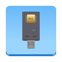

<div align="center">

# PicoForge All



**An unofficial PicoForge fork for Pico All security keys**

[](https://www.gnu.org/licenses/agpl-3.0)
[](https://github.com/BlueFunny19/picoforge-all/issues)

[](https://github.com/BlueFunny19/picoforge-all/stargazers)

</div>

> [!IMPORTANT]
> **Unofficial fork.** PicoForge All is maintained independently of [upstream PicoForge](https://github.com/librekeys/picoforge).
> Report problems with this build to **[BlueFunny19/picoforge-all/issues](https://github.com/BlueFunny19/picoforge-all/issues)**.
> Please do not submit bugs from this fork to the upstream repository.
>
> **Supported Firmwares:**
> - **[Pico All](https://github.com/XiaoNetwork-Astral/pico-all)**: v8.1; FIDO, PIV, OpenPGP, OATH/OTP and SmartCard-HSM management
> - **[RS-Key](https://github.com/TheMaxMur/RS-Key)**: v0.2.X, v0.3.X, v0.4.X
> - **[LibreKeys One](https://github.com/librekeys/pico-fido-firmwares/releases)**: v7.4.2
> - **[pico-fido](https://github.com/polhenarejos/pico-fido)**: v7.0, v7.2, v7.4, v7.6

## About

PicoForge All is an unofficial fork of PicoForge, a desktop application for configuring and managing RS-Key and pico-fido security keys. Built with Rust and GPUI, it provides an intuitive interface for:

- Reading device information and firmware details
- Configuring USB VID/PID and product names
- Adjusting LED settings (GPIO, brightness, driver)
- Inspecting, signing and installing Pico All firmware\n- Reviewing and applying staged Secure Boot provisioning
- Real-time system logging and diagnostics
- Support for multiple hardware variants and vendors

## Screenshots

<div align="center">

### Main Interface


### PassKeys Management


### Configuration Interface


</div>

## Installation

### Linux:

[](https://flathub.org/en-GB/apps/in.suyogtandel.picoforge)

### Other OS:

Build this fork from the source instructions below. Upstream packages and screenshots refer to the original PicoForge, not PicoForge All.

## Requirements

### Development Requirements

To contribute to PicoForge, you'll need:

- **[Rust](https://www.rust-lang.org/)** - System programming language (1.80+)
- **PC/SC Middleware**:
  - Linux: `pcscd` (usually pre-installed)
  - macOS: Built-in
  - Windows: Built-in

### Firmware management

Firmware signing and security setup use the bundled Pico All management engine.
Firmware and security workflows run natively in Rust. Install Raspberry Pi picotool, place it on PATH or set the PICOTOOL environment variable to its executable. No Python runtime is required. Signing uses an existing secp256k1 PEM key; key generation is external. Signed firmware is checked against the selected board before flashing.
A locked device requires its original trusted signing key.
Pico All OpenPGP factory reset requires applet version 5.0.1 or later, which restores OpenPGP PIN retries while preserving PIV state.

## Building from Source

### 1. Clone the Repository

```bash
git clone https://github.com/BlueFunny19/picoforge-all.git
cd picoforge-all
```

> [!TIP]
> Read-only mirrors are available for cloning:
>
> | Platform             | URL                                        |
> | :------------------- | :----------------------------------------- |
> | **GitHub (Primary)** | `https://github.com/BlueFunny19/picoforge-all`   |

### 2. Build and Run

To run the application in development mode:

```bash
cargo run
```

To build for production:

```bash
cargo build --release
```

The compiled binary will be available in `target/release/picoforge` (Linux/macOS) or `target/release/picoforge.exe` (Windows).

## Building and Development with Nix

[Nix](https://nixos.org/) provides developers with a complete and consistent development environment.

You can use Nix to build and develop picoforge painlessly.

### 1. Install Nix

Follow the [Installation Guide](https://nixos.org/download/#download-nix) and [NixOS Wiki](https://wiki.nixos.org/wiki/Flakes#Setup) to install Nix and enable Flakes.

### 2. Build & Run

#### a. with Flakes

You can build and run PicoForge with a single command:

```bash
nix run github:BlueFunny19/picoforge-all
```

Or simply build it and link to the current directory:

```bash
nix build github:BlueFunny19/picoforge-all
```

> [!TIP]
> You can use our binary cache to save build time by allowing Nix to set extra-substitutes.

#### b. without Flakes

Download the package definition:

```bash
curl -LO https://raw.githubusercontent.com/BlueFunny19/picoforge-all/main/package.nix
```

Run the following command in the directory containing `package.nix`:

```bash
nix-build -E 'with import <nixpkgs> {}; callPackage ./package.nix { }'
```

The compiled binary will be available at: `result/bin/picoforge`

### 3. Develop

You can enter a developement environement with all the required dependencies.

#### a. with Flakes

```bash
nix develop github:BlueFunny19/picoforge-all
```

#### b. without Flakes

You can use the `shell.nix` file that is at the root of the repository by running:

```bash
nix-shell
```

Then you can build from source and run the application with:

```bash
cargo run
```

## Contributing

Contributions are welcome (REALLY NEEDED, PLEASE HELP US)!

Please check the [CONTRIBUTING.md](.github/CONTRIBUTING.md) file for the full contribution process and development guidelines.

Reference the [project source code documentation](https://docs.librekeys.org/picoforge/picoforge/index.html) for API details and architecture overview.

## License


This project is licensed under the **GNU Affero General Public License v3.0 (AGPL-3.0-only)**.

See [LICENSE](LICENSE) for full details.

## Repository Maintainers

- **Suyog Tandel** ([@lockedmutex](https://github.com/lockedmutex))
- **Fabrice Bellamy** ([@Lab-8916100448256](https://github.com/Lab-8916100448256))

> The following acknowledgements and package-maintainer information refer to upstream PicoForge.
> Use this fork's issue tracker for PicoForge All support.

## Package Maintainers

- **JetCookies** ([@jetcookies](https://github.com/jetcookies)): Maintainer of the [Nix](https://nixos.org/) package.
- **Suyog Tandel** ([@lockedmutex](https://github.com/lockedmutex)): Maintainer of the [RPM](https://rpm.org/) package and Fedora Copr repository.

## Support

Report bugs and feature requests for **PicoForge All** at [this fork's issue tracker](https://github.com/BlueFunny19/picoforge-all/issues).
This is an unofficial build. The upstream PicoForge maintainers do not maintain or support this fork.

## Disclaimer

> [!WARNING]
> PicoForge is experimental software and still in the Beta stage!
> The app does contain bugs and is not secure by any means.
>
> It does not support all the features exposed by the `pico-fido` firmware and `pico-hsm`.

> [!CAUTION]
> **USB VID/PID Notice**: The vendor presets provided in this software include USB Vendor IDs (VID) and Product IDs (PID) that are the intellectual property of their respective owners. These identifiers are included for testing and educational purposes only. You are NOT authorized to distribute or commercially market devices using VID/PID combinations you do not own or license. Commercial distribution requires obtaining your own VID from the USB Implementers Forum ([usb.org](https://www.usb.org/getting-vendor-id)) and complying with all applicable trademark and certification requirements. Unauthorized use may violate USB-IF policies and intellectual property laws. The PicoForge developers assume no liability for misuse of USB identifiers.

---

<div align="center">

**Made with ❤️ by the LibreKeys community**

Copyright © 2026 Suyog Tandel

</div>
